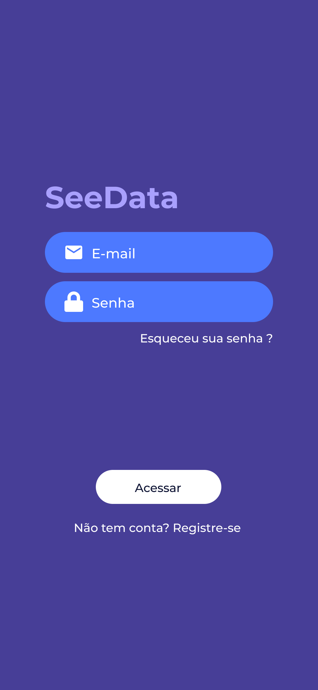
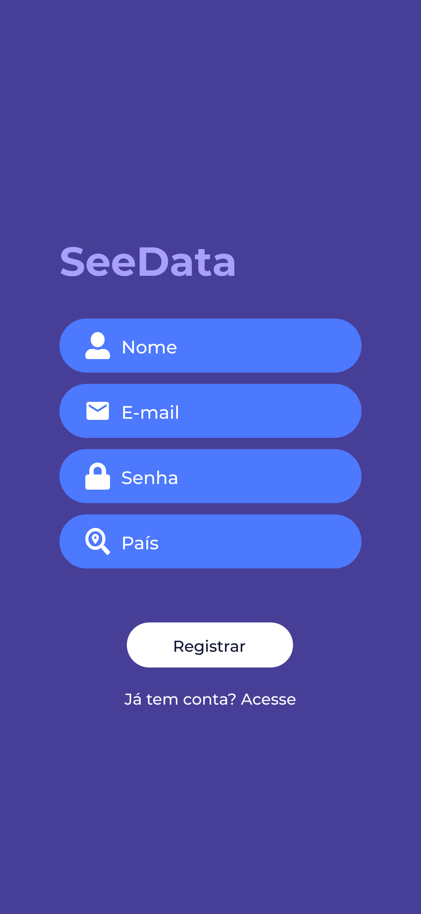
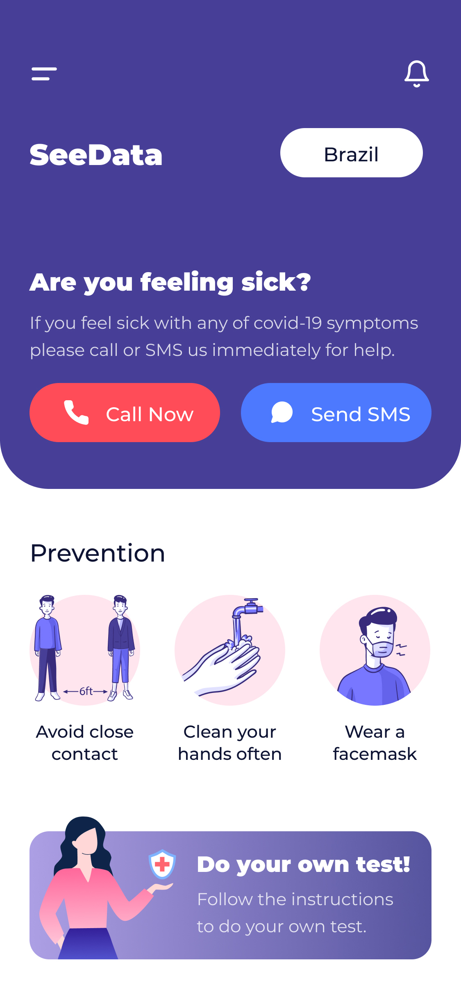
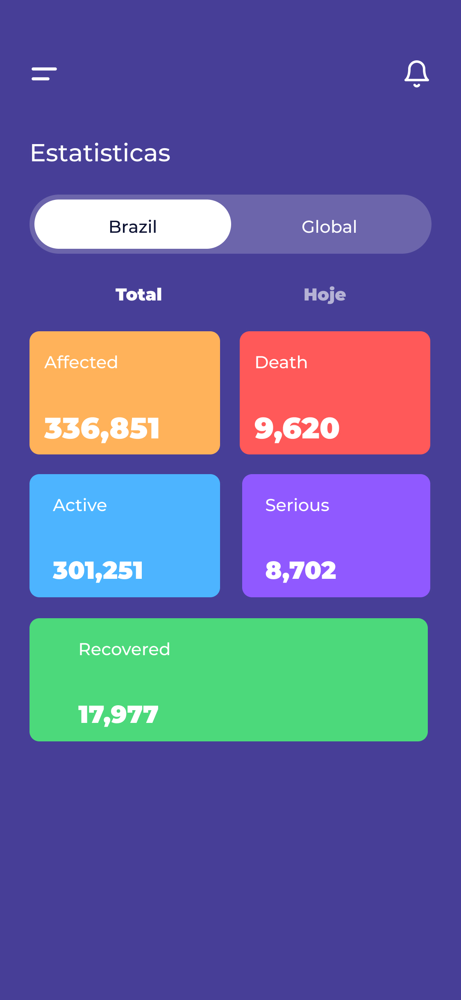

# App SeeData (Covid App) desenvolvido em Live

---

Este projeto foi desenvolvido em Live com o objetivo de aprender e usar técnicas já aprendidas. Foi utilizado [Expo](https://expo.io) para start do projeto

# :pushpin: Guia de Conteúdo

- [Screens](#point_right-screens)
- [Instalação](#construction_worker-instalação)
- [Primeiros passos](#runner-primeiros-passos)
- [Encontrou um bug? Falta alguma coisa?](#bug-issues)
- [Licença](#closed_book-licença)

# :point_right: Screens

# :construction_worker: Instalação

**Você precisa instalar [Node.js](https://nodejs.org/en/download/), [Npm](https://www.npmjs.com/), [Expo-cli](https://expo.io/learn) primero, e então, em ordem. Clone o projeto via HTTPS, rode o comando:**

`git clone https://github.com/jeanmolossi/covid-app.git`

URLs SSH proveem um acesso ao repositório via SSH com protocolo de segurança. Se você tem uma chave SSH registrada na sua conta do Github, clone o projeto usando o seguinte comando:

`git clone git@github.com:jeanmolossi/covid-app.git`

**Instale as dependencias**

`npm install`

Crie as variaveis de ambiente/configuração baseadas nos exemplos de configurações da pasta `src/config/`

Os arquivos de configurações são:

`firebase.example.ts` && `api.example.ts`

Copie os arquivos, rode os comandos: `cp firebase.example.ts firebase.ts` && `cp api.example.ts api.ts`

Para conseguir as chaves do Firebase, acesse o [Firebase Console](https://console.firebase.google.com/).

Para conseguir as chaves da Api, acesse o [Rapid API](https://rapidapi.com/Gramzivi/api/covid-19-data).

Após copiar os arquivos, certifique-se de preencher os novos arquivos com as configurações recebidas nos links acima.

# :runner: Primeiros passos

Execute o seguinte comando para iniciar a aplicação em ambiente de desenvolvimento:

`expo start`

**Se você quiser roda em seu dispositivo Mobile, instale o App do [Expo](https://play.google.com/store/apps/details?id=host.exp.exponent&referrer=www) disponível no Google Play para android e na AppStore para IOS, Você poderá também rodar no Emulador de seu PC**

# :bug: Issues

Sinta-se a vontade para **abrir uma nova issue** com o respectivo título e descrição no repositório [Covid App](https://github.com/jeanmolossi/covid-app/issues). Se você já encontrou a solução para o problema, **Vou adorar receber sua pull request**! Dê uma olhada em nosso [guia de contribuição](https://github.com/jeanmolossi/covid-app/blob/master/CONTRIBUTING.md) para encontrar os padrões de código.

# :closed_book: Licença

Liberada em 2020.
Este projeto está sob a licença [MIT license](https://github.com/jeanmolossi/covid-app/master/LICENSE).

Desenvolvido por [Jean Molossi](https://github.com/jeanmolossi) 🚀
